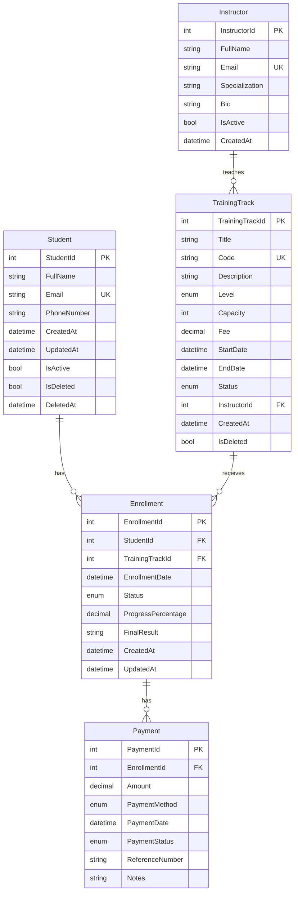

# Task 02 - Requirements to ERD

Database design for the TechMaster Training Center Registration API.

## Business Story

TechMaster Academy needs a backend to manage students, instructors, training tracks, enrollments, and payments. A student can enroll in many tracks; a track can have many students. Each enrollment stores date, status, progress, and final result. Each track has one main instructor. Payments link to enrollments and may be split across multiple transactions.

## ERD Diagram

## Entities and Keys

| Entity | PK | Unique | FK |
|--------|----|--------|-----|
| Student | StudentId | Email | — |
| Instructor | InstructorId | Email | — |
| TrainingTrack | TrainingTrackId | Code | InstructorId |
| Enrollment | EnrollmentId | — | StudentId, TrainingTrackId |
| Payment | PaymentId | — | EnrollmentId |

## Relationships

- **Student 1 → Many Enrollments** — a student can join multiple tracks over time.
- **TrainingTrack 1 → Many Enrollments** — a track accepts many students up to capacity.
- **Instructor 1 → Many TrainingTracks** — one instructor can lead multiple tracks.
- **Enrollment 1 → Many Payments** — tuition can be paid in installments.
- **Enrollment is a join entity** — carries Status, ProgressPercentage, FinalResult (not a simple many-to-many).

## Design Decisions

1. **Enrollment as join entity** — business data (status, progress) lives on the enrollment row.
2. **Soft delete on Student and TrainingTrack** — preserve history for reporting.
3. **Track Fee on TrainingTrack** — used to calculate remaining payment balance per enrollment.
4. **PaymentStatus enum** — only `Paid` payments count toward revenue reports.
5. **Cancelled enrollments excluded from capacity** — frees seats for new students.

## 10 Business Questions the Database Must Answer

1. Which students are enrolled in a specific track?
2. Which tracks have available seats?
3. Which enrollments are unpaid or partially paid?
4. How much revenue did each track generate?
5. Which instructor has the highest workload?
6. Which students have active enrollments?
7. Which tracks start this month?
8. What is the payment history for an enrollment?
9. Which tracks are full?
10. How many enrollments exist by status?

## Business Question Answers

### 1. Which students are enrolled in a specific track?

Join `Enrollments` to `Students` where `Enrollment.TrainingTrackId` matches the track.

**API:** `GET /api/tracks/{id}/students`

Returns student name, email, enrollment status, and enrollment date.

---

### 2. Which tracks have available seats?

Compare `TrainingTrack.Capacity` with the count of active enrollments (`Pending` or `Active`; `Cancelled` does not count).

**API:** `GET /api/reports/tracks-with-available-seats`

Returns capacity, active enrollments, and remaining seats per track.

---

### 3. Which enrollments are unpaid or partially paid?

For each enrollment, compare `TrainingTrack.Fee` (total required) with the sum of `Payment.Amount` where `PaymentStatus = Paid`.

**API:** `GET /api/reports/unpaid-enrollments`

Also filterable via `GET /api/enrollments?paymentStatus=unpaid` or `paymentStatus=partial`.

---

### 4. How much revenue did each track generate?

Sum `Payment.Amount` grouped by track through `Enrollment.TrainingTrackId`. Only `Paid` payments count.

**API:** `GET /api/reports/revenue-by-track`

Returns track title, total paid, and enrollment count.

---

### 5. Which instructor has the highest workload?

Count tracks per instructor and active students across those tracks.

**API:** `GET /api/reports/instructor-workload`

Returns instructor name, track count, and active student count. Sort by active students to find the highest workload.

---

### 6. Which students have active enrollments?

Filter `Enrollments` where `Status` is `Pending` or `Active`, then join to `Students`.

**API:** `GET /api/enrollments?status=Active`

Also `GET /api/students/{id}/enrollments` for one student's active history.

---

### 7. Which tracks start this month?

Filter `TrainingTracks` where `StartDate` falls within the current month and `IsDeleted = false`.

**API:** `GET /api/tracks?keyword=` combined with client-side or extended filter on `StartDate` (query: `StartDate >= first day of month AND StartDate <= last day of month`).

Tables involved: `TrainingTracks` only.

---

### 8. What is the payment history for an enrollment?

Query `Payments` where `Payment.EnrollmentId` matches the enrollment, ordered by `PaymentDate`.

**API:** `GET /api/enrollments/{id}/payments`

Also included in `GET /api/enrollments/{id}` details response.

---

### 9. Which tracks are full?

A track is full when active enrollment count (`Pending` + `Active`) equals or exceeds `TrainingTrack.Capacity`.

**API:** `GET /api/reports/track-capacity`

Tracks where `RemainingSeats = 0` are full.

---

### 10. How many enrollments exist by status?

Group `Enrollments` by `Status` (`Pending`, `Active`, `Completed`, `Cancelled`) and count.

**API:** `GET /api/enrollments?status=Pending` (repeat per status) or `GET /api/reports/dashboard-summary` for active enrollment totals.

Tables involved: `Enrollments` grouped on `Status`.
